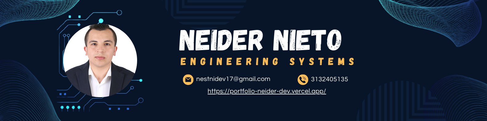

 <h1 align="center" style="margin: 5px;"><b>Hi, I'm Neider </b> </h1>

 

   
 
 

  <em>
    Welcome to my GitHub! I'm Neider Nieto,and my profession is <b>systems engineering</b> and i'm specialist in <b>strategic marketing</b>  I'm passionate about <b>Frontend programming. 
     
  </em> 

<h3>Current Projects</h3>

- ⚽ [Field Football](https://github.com/NesniDev/Field-Football) — Football management system for teams, players, and match tracking.
- 🤖 [BOT IFE](https://github.com/NesniDev/BOT-IFE) — Academic chatbot for institutional information.  
- 📈 [Portfolio](https://github.com/NesniDev/Portfolio-Neider.dev) — Personal portfolio showcasing projects, skills, and experience.  
- 💭 [ChatGPT Local](https://github.com/NesniDev/CHATGPT-LOCAL) — Local AI assistant running LLM models offline.  
- 🖥️ [Técnico en Sistemas](https://github.com/NesniDev/TecnicoSistemas) — Educational platform for systems and IT training.  
- ⚖️ [Page Lawyer](https://github.com/NesniDev/Page-Lawyer) — Professional website for a lawyer offering legal services 
- 🎨 [Artex Alex](https://github.com/NesniDev/ArtexAlex) — Creative website to showcase handmade products made with metal and wood.

  <h2>Technologies That I Know</h2>

&nbsp;
<table align="center">
  <tr>
    <td align="center">
      <strong>Frontend</strong>
       
      
    </td>
    <td align="center">
      <strong>Languages</strong>
       
      
    </td>
  </tr>
  <tr>
    <td align="center">
      <strong>Backend</strong>
       
      
    </td>
    <td align="center">
      <strong>Version Control</strong>
       
      
    </td>
  </tr>
  <tr>
    <td align="center">
      <strong>DevOps & Servers</strong>
       
      
    </td>
    <td align="center">
      <strong>Tools & Design</strong>
       
      
    </td>
  </tr>
  <tr>
    <td align="center">
      <strong>Shell & Terminal</strong>
       
      
    </td>
    <td align="center">
      <strong>Utilities & Dependencies</strong>
       
      
    </td>
  </tr>
</table>

    <h2>📈 GitHub Analytics</h2>

  
  

<h2 align="center">💼 Some of my Public Repositories</h2> 

  

    
    
    
    
  

  <h2 align="center" style="display: flex; justify-content: center; align-items: center;">Contact with me 📝 </h2>
  

  
  
  
  

